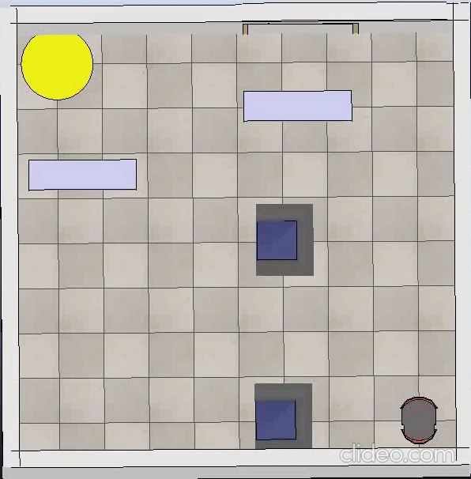
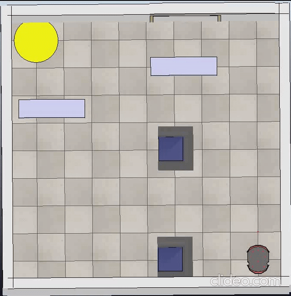
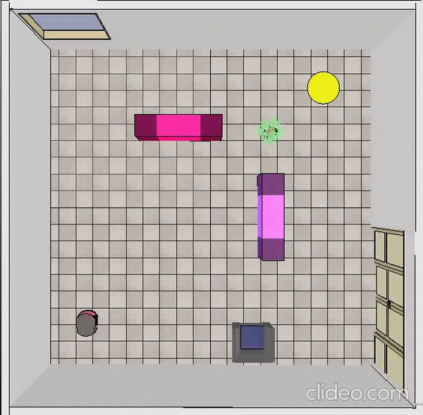
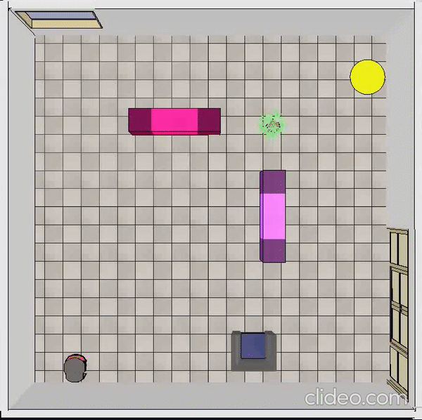
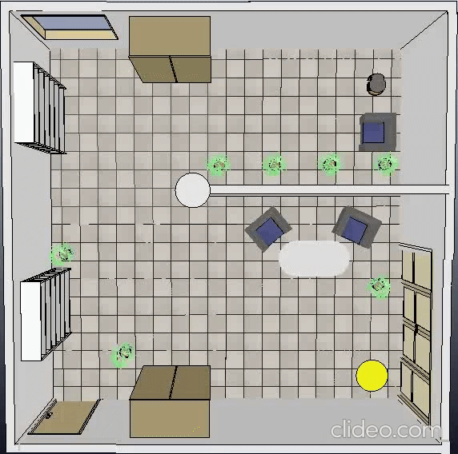
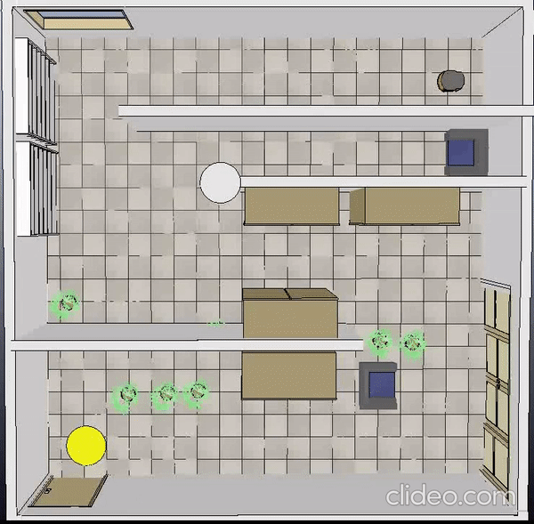

# AMR_Project

**Title**: Comparing classic and primitive-based versions of RRT*

The two versions of RRT* have been developed in an Ubuntu 18.04 environment using C++ and performing simulations in CoppeliaSim 4.0 EDU.

***
classical RRT*, environment 1:

primitive-based RRT*, environment 1:

classical RRT*, environment 2:

primitive-based RRT*, environment 2:

classical RRT*, environment 3:

primitive-based RRT*, environment 3:

classical RRT*, environment 4:

primitive-based RRT*, environment 4:

***

**Authors**:

Lorenzo Mattia 1793272

Michela Proietti 1739846

Sofia Santilli 1813509
